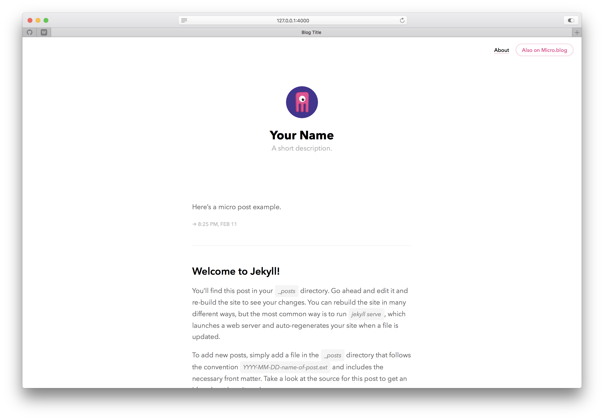

# MicroCactus Hugo Theme

A clean, minimal Hugo theme based on the [theme-marfa-demicroed](https://github.com/washchuk/theme-marfa-demicroed) with additional features:

## Features

- **Dark Mode Toggle**: A minimalist dark mode toggle that matches the theme's aesthetic
- **Truncated Post Content**: Homepage shows post summaries with "Continue Reading" links instead of full content
- **Clean Design**: Maintains the original clean, minimalist design

## Screenshot



## Installation

1. Download this theme to your Hugo site's themes directory:
```bash
cd themes
git clone https://github.com/chunsanger/microcactus.git microcactus
```

2. Add the theme to your site's configuration:
```toml
theme = "microcactus"
```

## Usage

This theme works with standard Hugo content organization. Create posts in the `content/post` directory with the usual Hugo front matter.

## Credits

This theme is a modified version of:
- [theme-marfa-demicroed](https://github.com/washchuk/theme-marfa-demicroed) by washchuk
- Originally inspired by [Cactus theme](https://github.com/eudicots/Cactus) for Jekyll

## License

MIT License

